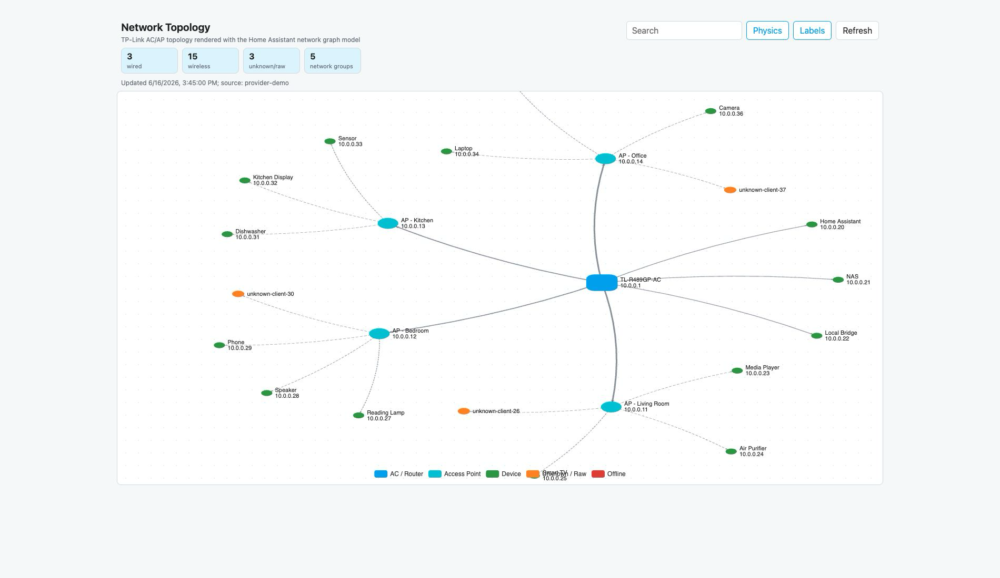
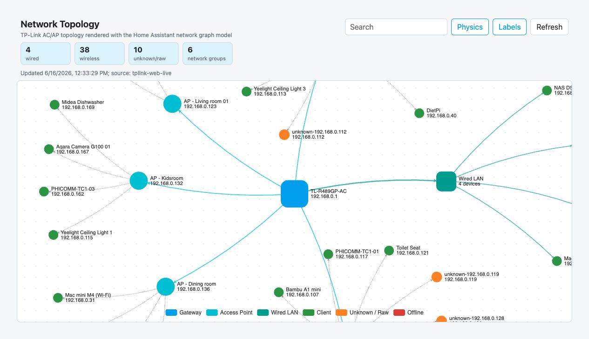

# Home Assistant Network Topology

[](https://my.home-assistant.io/redirect/hacs_repository/?owner=rz467fzs7d&repository=homeassistant-network-topology&category=integration)
[](https://my.home-assistant.io/redirect/config_flow_start?domain=network_topology)

Read-only Home Assistant custom integration for visualizing LAN topology:
routers, access points, wired clients, wireless clients, and unknown network
devices in one Home Assistant-style graph.

The project is intentionally **vendor-neutral**. TP-Link AC/AP support is the
first bundled data adapter, but the core model, Home Assistant entities, API,
and frontend are not tied to TP-Link. Other router, mesh, switch, and controller
brands can be added by implementing another adapter that outputs the shared
topology data model.



## Why This Exists

Home Assistant knows a lot about smart home devices, but the network path behind
those devices is usually hidden. In a modern home, that path matters:

- a phone or camera may be attached to a specific AP
- a device may be wired, wireless, or only visible to the network controller
- a known Home Assistant device may appear under a different router hostname
- an unknown client may explain noisy traffic or weak coverage
- AP attachment can provide better room-level context than "online on LAN"

This integration makes that topology visible without turning Home Assistant into
a router management UI.

## What It Provides

- HACS-compatible custom integration.
- UI setup through Home Assistant config flow.
- Local polling through `DataUpdateCoordinator`.
- Read-only topology endpoint:

  ```text
  /api/network_topology/topology
  ```

- Sidebar panel:

  ```text
  /network-topology
  ```

- Knowledge-graph style visualization:
  - solid links for wired connections
  - dashed links for wireless attachment
  - colored nodes for routers, APs, clients, unknown devices, and offline nodes
  - search and label toggles
  - graceful loading and error states

- `device_tracker` entities for network clients, with diagnostic attributes:
  - `ap_name`
  - `ssid`
  - `frequency`
  - `ip`
  - `signal_level`

Raw RSSI remains available in the topology JSON for visualization, but is not
written as a recorder-heavy entity attribute.

## Screenshots

### Home Assistant-Style Topology Graph


### TP-Link Adapter Preview

TP-Link is only one provider. The same graph and entity model can be fed by
other vendor adapters.



## Architecture

```text
Vendor adapter
  -> normalized topology model
      -> DataUpdateCoordinator
          -> topology store
              -> /api/network_topology/topology
              -> sidebar panel / Lovelace card
          -> device_tracker entities
```

The adapter boundary is the important part:

- Home Assistant integration code handles config entries, polling, entities,
  API exposure, and frontend registration.
- The frontend renders one normalized graph format.
- A vendor adapter only needs to collect data from its own controller and return
  normalized `ClientDevice` records plus root/controller metadata.

This keeps future support for UniFi, OpenWrt, ASUS, FRITZ!Box, Omada, managed
switches, or mesh systems as additive adapter work instead of new dashboards.

## Current Adapter

### TP-Link AC/AP Local Web API

The bundled TP-Link adapter talks to the local TP-Link AC/router web API.

It currently reads host/client topology data and normalizes:

- MAC address
- IP address
- hostname
- access point name
- SSID
- frequency / band
- RSSI
- online status

No TP-Link cloud account is required. No router settings are modified.

## Installation

### HACS Custom Repository

1. Open HACS.
2. Go to **Integrations**.
3. Open the three-dot menu and choose **Custom repositories**.
4. Add this repository URL:

   ```text
   https://github.com/rz467fzs7d/homeassistant-network-topology
   ```

5. Select category **Integration**.
6. Install **Network Topology**.
7. Restart Home Assistant.
8. Add **Network Topology** from **Settings -> Devices & services**.

### Manual

Copy the integration into your Home Assistant configuration directory:

```text
custom_components/network_topology
```

Restart Home Assistant, then add the integration from the UI.

The integration registers its own sidebar panel. You do not need a
`panel_custom` entry in `configuration.yaml`.

## Configuration

Configuration is handled through the Home Assistant UI.

For the bundled TP-Link adapter:

- **Host**: router or AC address reachable from Home Assistant
- **Username**: local web UI username
- **Password**: local web UI password
- **Scan interval**: polling interval in seconds

Credentials are stored in the Home Assistant config entry, not in the codebase.

## Automation Example

Because clients are exposed as `device_tracker` entities, topology can become
automation context.

```yaml
condition:
  - condition: state
    entity_id: device_tracker.nt_patricks_iphone
    attribute: ap_name
    state: "AP - Living room 01"
```

Example use cases:

- room-aware presence from AP attachment
- alerts when a fixed device roams to the wrong AP
- troubleshooting when a camera is online but attached to a weak node
- detecting unknown devices seen by the network controller

## Adapter Model

Adapters should be small and read-only. A provider implementation should:

1. authenticate to the local controller or router
2. fetch the current client attachment table
3. normalize vendor-specific fields into the shared data model
4. avoid making configuration changes

The graph renderer does not know which vendor produced the data.

## Scope

This integration is intentionally read-only.

It does not manage:

- DHCP reservations
- static IP bindings
- firewall rules
- VLANs
- DNS filtering
- Wi-Fi settings
- router or AP configuration

Those actions belong in vendor-specific management tools, not in this topology
viewer.

## Development

Run syntax checks:

```bash
python3 -m compileall custom_components
```

The normalization and graph-building layers are designed to be tested without a
live router.

## Status

This is an early integration focused on proving a reusable network topology
model for Home Assistant. The TP-Link adapter is useful today, but the longer
term goal is a vendor-neutral topology surface that multiple integrations can
feed.
